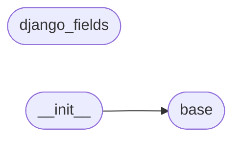

# Code Overview

[_Documentation generated by Documatic_](https://www.documatic.com)

<!---Documatic-section-Codebase Structure Python-start--->
## Codebase Structure Python

The codebase has a flat structure, with 3 code files.

<!---Documatic-block-system_architecture-start--->

<!---Documatic-block-system_architecture-end--->

# #
<!---Documatic-section-Codebase Structure Python-end--->

<!---Documatic-section-Key Objects-start--->
## Key Objects

There are exposed imports at level-0
from the source directory (semantic_version)

<!---Documatic-block-semantic_versio-start--->

	
<code>semantic_versio</code> (Click to Expand!)

* `semantic_version.base.NpmSpec`
* `semantic_version.base.SimpleSpec`
* `semantic_version.base.Spec`
* `semantic_version.base.SpecItem`
* `semantic_version.base.Version`
* `semantic_version.base.compare`
* `semantic_version.base.match`
* `semantic_version.base.validate`

<!---Documatic-block-semantic_versio-end--->

# #
<!---Documatic-section-Key Objects-end--->

<!---Documatic-section-Important Functions-start--->
## Important Functions

<!---Documatic-block-important_funcs-start--->
<!---Documatic-block-most_used_funcs-start--->
### Most Utilised Functions

* semantic_version.base.compare (1 times)
* semantic_version.base.match (1 times)
* semantic_version.base.validate (1 times)
<!---Documatic-block-most_used_funcs-end--->

<!---Documatic-block-end_user_funcs-start--->
### End User Exposed Functions

* semantic_version.base.validate
* semantic_version.base.Version
* semantic_version.base.NpmSpec
* semantic_version.base.Spec
* semantic_version.base.match
* semantic_version.base.SimpleSpec
* semantic_version.base.compare
* semantic_version.base.SpecItem
<!---Documatic-block-end_user_funcs-end--->
<!---Documatic-block-important_funcs-end--->

# #
<!---Documatic-section-Important Functions-end--->

<!---Documatic-section-Class Hierarchy-start--->
## Class Hierarchy

<!---Documatic-block-BaseSpec-start--->

	
<code>BaseSpec</code> (Click to Expand!)

* semantic_version.base.NpmSpec
* semantic_version.base.SimpleSpec

<!---Documatic-block-BaseSpec-end--->

<!---Documatic-block-Clause-start--->

	
<code>Clause</code> (Click to Expand!)

* semantic_version.base.AllOf
* semantic_version.base.AnyOf
* semantic_version.base.Matcher

<!---Documatic-block-Clause-end--->

<!---Documatic-block-models.CharField-start--->

	
<code>models.CharField</code> (Click to Expand!)

* semantic_version.django_fields.SemVerField

<!---Documatic-block-models.CharField-end--->

<!---Documatic-block-semantic_version.base.Matcher-start--->

	
<code>semantic_version.base.Matcher</code> (Click to Expand!)

* semantic_version.base.Always
* semantic_version.base.Never
* semantic_version.base.Range

<!---Documatic-block-semantic_version.base.Matcher-end--->

<!---Documatic-block-semantic_version.base.SimpleSpec-start--->

	
<code>semantic_version.base.SimpleSpec</code> (Click to Expand!)

* semantic_version.base.LegacySpec

<!---Documatic-block-semantic_version.base.SimpleSpec-end--->

<!---Documatic-block-semantic_version.django_fields.SemVerField-start--->

	
<code>semantic_version.django_fields.SemVerField</code> (Click to Expand!)

* semantic_version.django_fields.SpecField
* semantic_version.django_fields.VersionField

<!---Documatic-block-semantic_version.django_fields.SemVerField-end--->

# #
<!---Documatic-section-Class Hierarchy-end--->

[_Documentation generated by Documatic_](https://www.documatic.com)