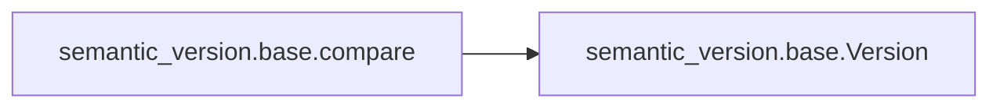

# Semantic Version Base

[_Documentation generated by Documatic_](https://www.documatic.com)

<!---Documatic-section-Codebase Structure-start--->
## Codebase Structure

<!---Documatic-block-system_architecture-start--->
```mermaid
None
```
<!---Documatic-block-system_architecture-end--->

# #
<!---Documatic-section-Codebase Structure-end--->

<!---Documatic-section-semantic_version.base._has_leading_zero-start--->
## semantic_version.base._has_leading_zero

<!---Documatic-section-_has_leading_zero-start--->
<!---Documatic-block-semantic_version.base._has_leading_zero-start--->
<details>
	<summary><code>semantic_version.base._has_leading_zero</code> code snippet</summary>

```python
def _has_leading_zero(value):
    return value and value[0] == '0' and value.isdigit() and (value != '0')
```
</details>
<!---Documatic-block-semantic_version.base._has_leading_zero-end--->
<!---Documatic-section-_has_leading_zero-end--->

# #
<!---Documatic-section-semantic_version.base._has_leading_zero-end--->

<!---Documatic-section-semantic_version.base.compare-start--->
## semantic_version.base.compare

<!---Documatic-section-compare-start--->


### Object Calls

* semantic_version.base.Version

<!---Documatic-block-semantic_version.base.compare-start--->
<details>
	<summary><code>semantic_version.base.compare</code> code snippet</summary>

```python
def compare(v1, v2):
    return Version(v1).__cmp__(Version(v2))
```
</details>
<!---Documatic-block-semantic_version.base.compare-end--->
<!---Documatic-section-compare-end--->

# #
<!---Documatic-section-semantic_version.base.compare-end--->

<!---Documatic-section-semantic_version.base.match-start--->
## semantic_version.base.match

<!---Documatic-section-match-start--->
<!---Documatic-block-semantic_version.base.match-start--->
<details>
	<summary><code>semantic_version.base.match</code> code snippet</summary>

```python
def match(spec, version):
    return Spec(spec).match(Version(version))
```
</details>
<!---Documatic-block-semantic_version.base.match-end--->
<!---Documatic-section-match-end--->

# #
<!---Documatic-section-semantic_version.base.match-end--->

<!---Documatic-section-semantic_version.base.validate-start--->
## semantic_version.base.validate

<!---Documatic-section-validate-start--->
<!---Documatic-block-semantic_version.base.validate-start--->
<details>
	<summary><code>semantic_version.base.validate</code> code snippet</summary>

```python
def validate(version_string):
    try:
        Version.parse(version_string)
        return True
    except ValueError:
        return False
```
</details>
<!---Documatic-block-semantic_version.base.validate-end--->
<!---Documatic-section-validate-end--->

# #
<!---Documatic-section-semantic_version.base.validate-end--->

[_Documentation generated by Documatic_](https://www.documatic.com)